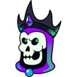

# Litch
Litch is a **work-in-progress** application for streamers to improve interactability and fun.

## Design
Litch uses a modular approach to allow dynamically loading:

  * **Services** for providing Twitch integration, bot support, etc.
  * **Modules** for providing overlay effects such as falling snow, fireworks, PNG tubers, and more

With this design, third-party additions to add custom functionality are just self-contained NPM packages.

## Gregory

Gregory is the Lich of Litch and is copyright of the Litch Developers. It may not be used for any purpose beyond advertising, embedding, or any usage necessary to link to the Litch software, except where a lich is to be used in a tabletop game, in which case it can be used under the condition that the lich must be called Gregory.